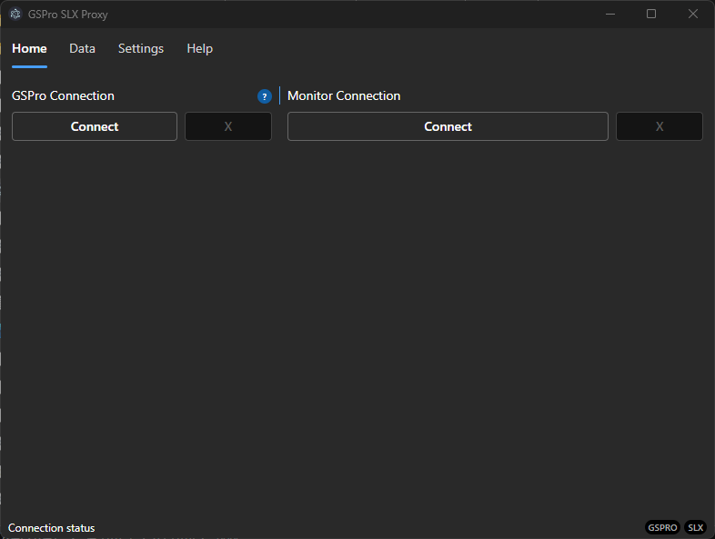

# GSPro SLX Proxy

To resolve some issues and provide some features this application can be configured to act as a proxy between the [SLX Connect](https://support.swinglogic.us/hc/en-us) and [GSPConnector](https://gsprogolf.com/GSProConnectV1.html).

## Purpose

This application sits between SLX Connect and GSPro, providing:

- A filter to stop invalid shot data from getting to GSPro and therefore reseting club selection. This doesn't occur all the time, but it makes it impossible to change clubs at specific times

### Screenshots

#### Home

Connect to and accept connections from GSPro and SLX (respectively). The application allows connection/disconnection at any point; although the SLX and GSPro side of things will need to be restarted.



## Configuration

To get the proxy running:

1. Download and install the application
2. Make the appropriate changes to GSPro configuration

> GSPConnect needs to be configured to use alternate port. To do this edit the file `C:\GSPro\GSPC\GSPconnect.exe.config` and make the change `<OpenAPIUseAltPort>true</OpenAPIUseAltPort>`. This will start GSPConnect on port `922`, instead of `921`.

3. Start GSPro and ensure the GSPConnector is up
4. Start the Proxy and click both connect buttons

> At this point you should see the green bar on GSPConnect. You will also start listenting for SLX Connect

5. Start SLX Connect and open the widget, click connect.

## Contribution

Feel free to:

- Open any issues/requests for bugs/features
- Pull Requests with added features/bug fixes
- Fork to your hearts content to get working

Pretty straight forward to get started:

### Getting the app started

```
$ npm install
$ npm run dev
```

### Running tests

Test are separated into `nodejs` and `frontend`; which can be run using the following:

```
$ npm run test
$ npm run testui
```

> Both of which have a `:watch` alternative. I suggest/recommend adding tests openning a pull request.

### Lint / Typecheaking

```
$ npm run lint
$ npm run typecheck:main
$ npm run typecheck:preload
$ npm run typecheck:renderer
```

### Build and package app

```
$ npm build && npm package
```
